# Налаштування Telegram бота — Desktop

## Крок 1. Знайдіть BotFather у Telegram

Відкрийте пошук у застосунку Telegram і введіть **BotFather**. Перейдіть у цього бота.

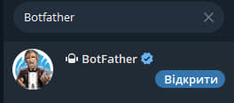

---

## Крок 2. Створіть нового бота

Напишіть боту команду `/newbot`, щоб розпочати реєстрацію.

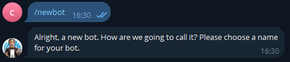

---

## Крок 3. Придумайте назву бота

BotFather попросить вас ввести **назву** для бота — вона може бути будь-якою. Введіть її та надішліть.

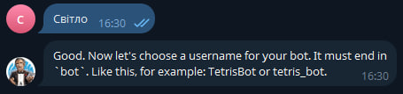

---

## Крок 4. Придумайте юзернейм та збережіть токен

Тепер потрібно придумати **юзернейм** для бота. Він має бути написаний латиницею і обов'язково закінчуватись на слово `bot` (наприклад: `my_lightwatcher_bot`). Введіть його та надішліть.

Якщо реєстрація пройшла успішно, BotFather надішле вам:
- 🔗 **Посилання** на вашого бота
- 🔑 **API токен** — скопіюйте та збережіть його! Він знадобиться пізніше.

Після цього перейдіть до бота за синім посиланням і натисніть **Start**.

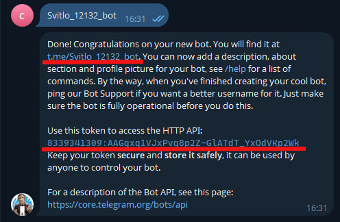

---

## Крок 5. Знайдіть бота @myidbot

Знову відкрийте пошук у Telegram і знайдіть бота **@myidbot**.

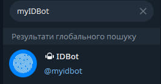

---

## Крок 6. Отримайте ваш Chat ID

Напишіть боту команду `/getid`. Він поверне ваш особистий **Chat ID** — скопіюйте або запишіть його.

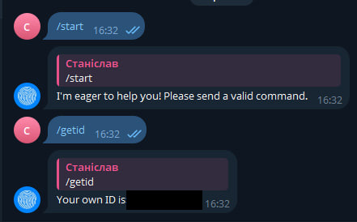

---

## Крок 7–16. Налаштування групи *(необов'язково)*

> Цей розділ потрібен лише якщо ви хочете, щоб бот відправляв повідомлення у Telegram-групу.

### Крок 7. Відкрийте список своїх ботів

У BotFather введіть команду `/mybots` та виберіть зі списку нещодавно створеного бота.

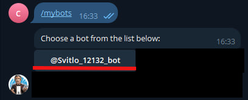

---

### Крок 8. Відкрийте налаштування бота

Натисніть кнопку **Bot Settings**.

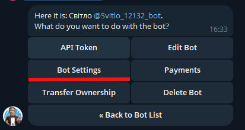

---

### Крок 9. Дозвольте боту працювати у групах

Натисніть **Allow Groups?** і переконайтеся, що групи увімкнені.

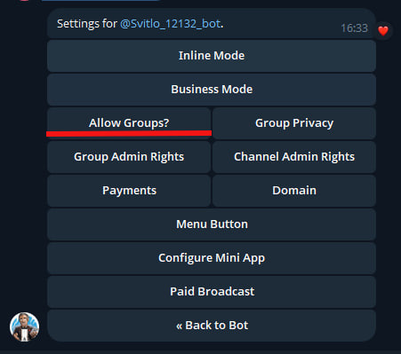

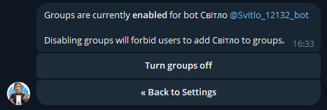

---

### Крок 10. Створіть нову групу

Натисніть на **три смужки** у лівому верхньому куті і виберіть **Нова група**.

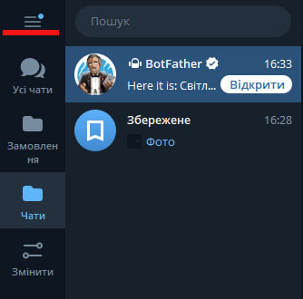

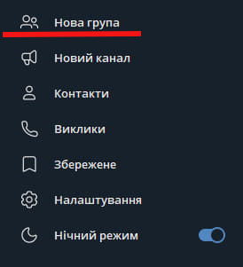

---

### Крок 11. Придумайте назву групи

Введіть назву для групи. Коли система запитає додати учасників — можете пропустити цей крок і додати їх пізніше.

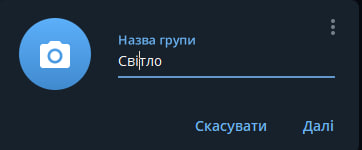


---

### Крок 12. Додайте учасників до групи

Відкрийте групу, натисніть **Більше** та виберіть **Додати учасників**.

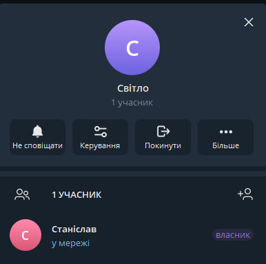

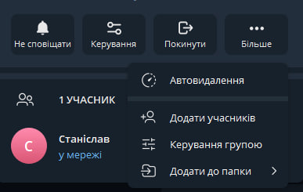

---

### Крок 13. Додайте обох ботів до групи

У пошуку знайдіть вашого бота (за юзернеймом) та **@myidbot** і додайте їх обох.

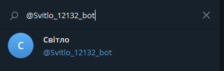

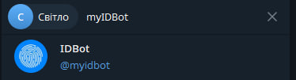

---

### Крок 14. Призначте ботів адміністраторами

Зробіть **@myidbot** адміністратором групи, а потім повторіть те ж саме для вашого бота.

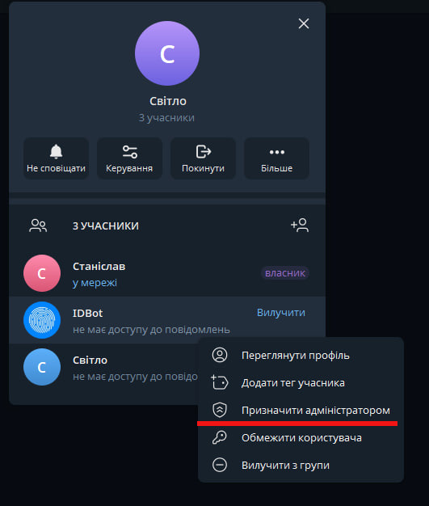

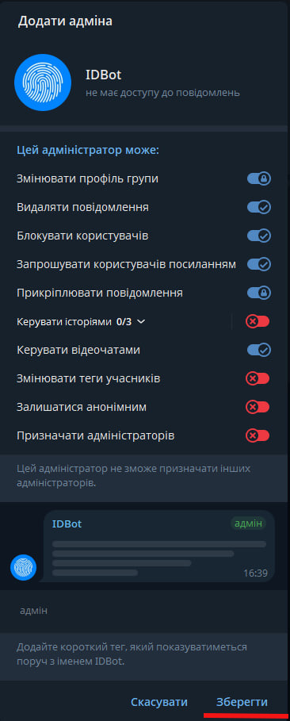

---

### Крок 15. Перевірте результат

Список адміністраторів групи має виглядати приблизно так:

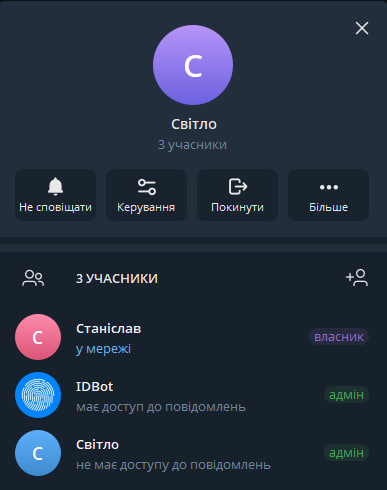

---

### Крок 16. Отримайте ID групи

Напишіть у групу команду `/getgroupid`. Скопіюйте або збережіть отриманий **Group Chat ID** — він обов'язково починається з мінуса (`-`).

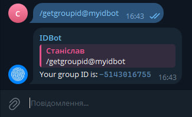

---

## Крок 17. Підключіться до мережі LightWatcher

Увімкніть пристрій **LightWatcher**. Відкрийте список Wi-Fi мереж на комп'ютері та підключіться до мережі **`Light_Watcher_Setup`**.

---

## Крок 18. Відкрийте веб-інтерфейс

Після підключення браузер може відкритися автоматично. Якщо цього не сталося — введіть у адресному рядку:

```
192.168.4.1
```

---

## Крок 19. Заповніть налаштування

На сторінці конфігурації заповніть усі необхідні поля:

| Поле | Що вводити |
| :--- | :--- |
| Назва Wi-Fi | Назва вашої домашньої мережі |
| Пароль Wi-Fi | Пароль до неї |
| Токен бота | Токен, збережений на кроці 4 |
| Chat ID | Ваш ID з кроку 6 |
| Group Chat ID | ID групи з кроку 16 *(якщо створювали)* |

> 💡 **Порада:** підготуйте ці дані заздалегідь — запишіть у нотатки на телефоні або на папері, щоб не шукати їх під час налаштування.

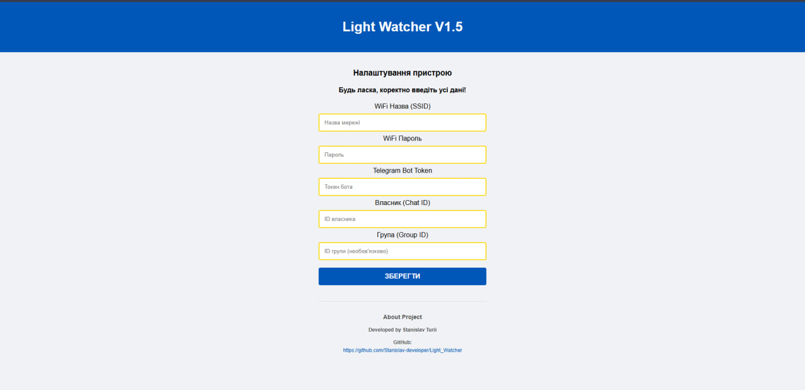

---

## ❓ Вирішення поширених проблем

### Бот не надіслав стартове повідомлення після налаштування
- Поставте пристрій на зарядку та зачекайте хвилину
- Переконайтеся, що роутер увімкнений і працює
- Перевірте правильність усіх введених даних (токен, Chat ID, Wi-Fi)

### Бот не надсилає повідомлення у групу
- Перевірте, чи вказали Group Chat ID разом із мінусом на початку (наприклад: `-1001234567890`)
- ID групи може змінитися — напишіть `/getgroupid` у групу знову та оновіть значення у налаштуваннях

### Пристрій не підключається до Wi-Fi
- Переконайтеся, що роутер підтримує діапазон **2.4 GHz** (пристрій не працює з 5 GHz)
- Перевірте, чи роутер не блокує нові пристрої
- Ще раз перевірте правильність назви мережі та пароля

### Мережа `Light_Watcher_Setup` не з'являється при повторному налаштуванні
Пристрій не переходить у режим налаштування, якщо вже підключений до збереженої Wi-Fi мережі. Щоб вирішити:
- Тимчасово вимкніть роутер **або** винесіть пристрій за межі Wi-Fi сигналу
- Зачекайте **1–2 хвилини** — мережа `Light_Watcher_Setup` з'явиться

### Бот не реагує на зникнення/появу світла
- Перевірте якість **USB-кабелю та блоку живлення**
- ⚠️ Пристрій **не працює** з кабелями Type-C — Type-C. Використовуйте кабель **Type-A — Type-C**
